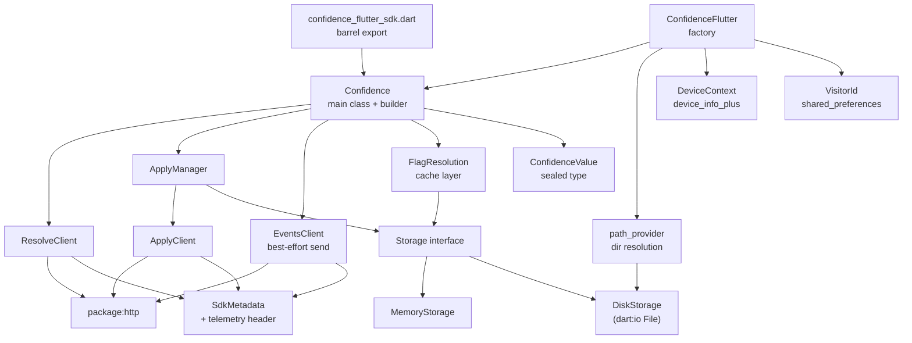

# Native Dart SDK for Confidence Flutter — Implementation Plan

## Context

The current `confidence_flutter_sdk` (v0.2.1) is a thin method-channel bridge. The Dart layer (`lib/`) is three files totaling ~160 lines — just an in-memory flag cache, type wrappers for platform serialization, and `unawaited()` calls to native for apply tracking. All real logic lives in the Kotlin Android SDK (`confidence-sdk-android:0.6.2`) and the Swift SDK (git submodule at `ios/Classes/confidence-sdk`).

This means: iOS+Android only, two native codebases to maintain, a fragile git-submodule CI dance (copy Swift sources, delete submodule, build), and no Dart-side tests. The backend is pure REST/JSON, so a Dart-native implementation is fully feasible and eliminates all of this.

**Goal**: Replace the native bridge with a pure Dart implementation covering the core features of both native SDKs. The SDK becomes testable in pure Dart, and platform support expands to web/desktop for free. The native SDKs (Android/iOS) remain alongside during development so integration tests can validate behavioral parity.

---

## Architecture: Single Package

Keep the existing `confidence_flutter_sdk` package rather than splitting into two. The pure-Dart core lives cleanly in `lib/src/` with zero Flutter imports; it can be extracted into its own package later if needed. The Flutter-specific pieces (directory path resolution, device info, visitor ID) live in `lib/src/flutter/`.

```
lib/
  confidence_flutter_sdk.dart          # barrel export (public API)
  src/
    confidence.dart                    # Confidence class + builder
    confidence_value.dart              # Sealed ConfidenceValue type
    evaluation.dart                    # Evaluation<T> + ResolveReason
    flag_resolution.dart               # FlagResolution model + cache
    resolve_client.dart                # HTTP POST /v1/flags:resolve
    apply_manager.dart                 # Exposure tracking (pull-send-restore)
    apply_client.dart                  # HTTP POST /v1/flags:apply
    events_client.dart                 # HTTP POST /v1/events:publish (best-effort)
    storage.dart                       # Storage interface + MemoryStorage + DiskStorage
    sdk_metadata.dart                  # SDK ID/version + telemetry header
    flutter/
      flutter_storage.dart             # path_provider directory resolution
      device_context.dart              # device_info_plus enrichment
      visitor_id.dart                  # shared_preferences UUID
      confidence_flutter.dart          # Factory that wires Flutter deps
```

### Dependency Flow



### Storage: Pure Dart Disk I/O

`DiskStorage` uses `dart:io` `File` directly — pure Dart, no platform channel needed. Works on mobile, desktop, and server. The only Flutter-specific piece is resolving the correct directory path via `path_provider` (done once in `ConfidenceFlutter.create()`), which passes the path into `DiskStorage(directoryPath)`. Web needs a separate adapter in the future, but is out of scope.

---

## Public API

### Primary API (aligned with native SDKs)

```dart
class Confidence {
  // Construction
  static ConfidenceBuilder builder({required String clientSecret});

  // Flag lifecycle
  Future<void> fetchAndActivate();
  Future<void> activate();
  Future<void> asyncFetch();

  // Flag evaluation (generic)
  T getValue<T>(String flagPath, T defaultValue);
  Evaluation<T> getFlag<T>(String flagPath, T defaultValue);

  // Context
  void putContext(String key, ConfidenceValue value);
  void putContextLocal(String key, ConfidenceValue value);  // no re-fetch
  void removeContext(String key);
  Confidence withContext(Map<String, ConfidenceValue> context);  // child instance
  Map<String, ConfidenceValue> getContext();

  // Events
  void track(String eventName, [Map<String, ConfidenceValue> data]);
  void flush();
}
```

### Builder

```dart
Confidence.builder(clientSecret: 'xxx')
  .region(ConfidenceRegion.eu)
  .loggerLevel(LoggingLevel.warn)
  .initialContext({'targeting_key': ConfidenceValue.string('user-123')})
  .storage(myCustomStorage)       // DI for testing
  .build();
```

### Flutter convenience factory

```dart
final confidence = await ConfidenceFlutter.create(
  clientSecret: 'xxx',
  region: ConfidenceRegion.eu,
);
await confidence.fetchAndActivate();
```

Wires up DiskStorage (via path_provider), VisitorIdManager, and DeviceContextProvider automatically.

### Legacy compat (extension methods)

```dart
extension ConfidenceLegacyApi on Confidence {
  bool getBool(String key, bool defaultValue) => getValue<bool>(key, defaultValue);
  String getString(String key, String defaultValue) => getValue<String>(key, defaultValue);
  int getInt(String key, int defaultValue) => getValue<int>(key, defaultValue);
  double getDouble(String key, double defaultValue) => getValue<double>(key, defaultValue);
}
```

---

## Type System

### ConfidenceValue (sealed class)

```dart
sealed class ConfidenceValue {
  static ConfidenceValue boolean(bool value);
  static ConfidenceValue string(String value);
  static ConfidenceValue integer(int value);
  static ConfidenceValue double_(double value);
  static ConfidenceValue date(DateTime value);
  static ConfidenceValue timestamp(DateTime value);
  static ConfidenceValue list(List<ConfidenceValue> value);
  static ConfidenceValue structure(Map<String, ConfidenceValue> value);
  static ConfidenceValue null_();
}
```

### Evaluation

```dart
class Evaluation<T> {
  final T value;
  final String? variant;
  final ResolveReason reason;
  final String? errorCode;
  final String? errorMessage;
}

enum ResolveReason {
  match, unspecified, noSegmentMatch, noTreatmentMatch,
  flagArchived, targetingKeyError, error, stale,
}
```

---

## Concurrency Model

Dart is single-threaded with cooperative async. No locks needed, but we need guards:

- **Flag fetching**: `AsyncGate` (Completer-based) prevents duplicate concurrent resolve requests. If `putContext()` triggers a re-fetch while one is in-flight, the second waits then starts.
- **Apply pipeline**: Simple guard prevents overlapping batch uploads.
- **Stale response discarding**: If context changed during an in-flight resolve, discard the response (matches Android SDK behavior).

---

## Implementation Phases

Each phase produces a working, testable increment.

### Phase 0: Test Suite Foundation

Before writing any implementation, create the test suite by studying the Android and Swift SDK test suites. This ensures test-driven development and behavioral parity.

**Study the native SDK tests:**
- Android: `confidence-sdk-android` test suite (resolve response parsing, value evaluation, apply behavior, context management)
- Swift: `confidence-sdk-swift` test suite (same areas)
- Extract the key test scenarios and expected behaviors

**Files to create:**
- `test/confidence_value_test.dart` — JSON serialization round-trips, type coercion, nested structure handling
- `test/flag_resolution_test.dart` — Dot-path evaluation (`"my-flag.color.hex"`), type mismatch returns default, missing flag returns default, schema validation
- `test/resolve_client_test.dart` — Request format matches wire spec, response parsing, error responses (404, 500), region URL selection
- `test/apply_manager_test.dart` — Dedup (same flag not sent twice per resolve token), restore-on-failure, `shouldApply: false` skips apply
- `test/events_client_test.dart` — Event serialization, context merging into payload
- `test/confidence_test.dart` — `fetchAndActivate()` flow, `activate()` + `asyncFetch()` flow, context changes trigger re-fetch, `getValue<T>()` type resolution, stale response discarding
- `test/storage_test.dart` — MemoryStorage and DiskStorage CRUD operations

All tests use mocked `http.Client`. Tests will initially fail (no implementation); each subsequent phase makes them pass.

---

### Phase 1: Core Types + Flag Resolution

Build the type system and flag resolution — the foundation everything else depends on.

**Files to create:**
- `lib/src/confidence_value.dart` — Sealed class hierarchy with subtypes for each value kind. Convenience constructors on sealed parent. `toJson()`/`fromJson()` mapping to the backend's protobuf-JSON Struct format.
- `lib/src/evaluation.dart` — `Evaluation<T>` with `value`, `variant`, `reason` (enum), `errorCode`, `errorMessage`.
- `lib/src/flag_resolution.dart` — `FlagResolution` model: `resolvedFlags` list, `resolveToken`. `ResolvedFlag` with `flag`, `variant`, `value`, `flagSchema`, `reason`, `shouldApply`. Dot-path evaluation method (port from existing `resolveKey` at `confidence_flutter_sdk.dart:39-55`, but typed with `ConfidenceValue`). JSON serialization for disk persistence.
- `lib/src/sdk_metadata.dart` — SDK ID (`SDK_ID_DART_CONFIDENCE`), version string. Builds the `X-CONFIDENCE-TELEMETRY` header included on every HTTP request.
- `lib/src/resolve_client.dart` — Takes `http.Client`, base URL, client secret. `resolve(flags, context, sdk)` POSTs to `/v1/flags:resolve`, returns `FlagResolution`. Region enum: `global` -> `https://resolver.confidence.dev`, `eu` -> `https://resolver.eu.confidence.dev`.
- `lib/src/storage.dart` — `Storage` abstract class (`read(key)`, `write(key, data)`, `delete(key)`, `exists(key)`). `MemoryStorage` (in-memory map). `DiskStorage` (takes directory path, stores each key as a file using `dart:io` `File`).
- `lib/src/confidence.dart` — `Confidence` class with builder. Phase 1 scope: construction, `fetchAndActivate()`, `getValue<T>()`, `getFlag<T>()`, `putContext()`, `putContextLocal()` (no re-fetch), `removeContext()`, `getContext()`, `withContext()` (child instance with parent context chain). Two-layer cache: "current" (active, read from) and "latest" (just fetched). `fetchAndActivate()` fetches then swaps latest->current.

**Passes:** Phase 0 tests for confidence_value, flag_resolution, resolve_client, storage, and the basic confidence flow tests.

---

### Phase 2: Apply Mechanism

Add exposure tracking — tells the backend which flags were actually evaluated.

**Files to create:**
- `lib/src/apply_client.dart` — POSTs to `/v1/flags:apply` with flag name, apply time, resolve token.
- `lib/src/apply_manager.dart` — Simple approach: tracks applied flags in storage as a set per resolve token. On `getValue()`/`getFlag()`, if `shouldApply` is true and flag hasn't been applied, add to pending set, send immediately. On failure, keep in pending set for retry on next evaluation. No state machine — just pull pending from storage, attempt send, restore on failure.

**Files to modify:**
- `lib/src/confidence.dart` — Add `activate()` (swap cache without fetching), `asyncFetch()` (fetch in background), `activateAndFetchAsync()` convenience. Wire `ApplyManager` into `getValue()`/`getFlag()`. Add `AsyncGate` (Completer-based) to prevent duplicate concurrent resolve requests. Add stale-response discarding: if context changes during an in-flight resolve, discard the response.

**Passes:** Phase 0 apply_manager tests.

---

### Phase 3: Event Tracking

Best-effort event sending — no buffering, no persistence. Send immediately.

**Files to create:**
- `lib/src/events_client.dart` — POSTs to `/v1/events:publish`. Best-effort: fire-and-forget, log errors. Events endpoint URLs: `https://events.confidence.dev` (global) / `https://events.eu.confidence.dev` (EU). Each event includes: `eventDefinition` name, `eventTime`, `payload` (merged with current context), `sendTime`. Future iteration may add retry with backoff/jitter.

**Files to modify:**
- `lib/src/confidence.dart` — Add `track(eventName, [data])` and `flush()`. `track()` builds the event payload by merging `data` with current context and sends via `EventsClient`.

**Passes:** Phase 0 events_client tests.

---

### Phase 4: Flutter Integration + SDK Telemetry

Wire up Flutter-specific platform features and the telemetry header.

**Files to create:**
- `lib/src/flutter/flutter_storage.dart` — Resolves the app documents directory via `path_provider`, creates a `DiskStorage` pointed at `{documentsDir}/confidence/`.
- `lib/src/flutter/visitor_id.dart` — Generates UUID v4 on first launch, persists via `shared_preferences`, provides `targeting_key` to context if not already set.
- `lib/src/flutter/device_context.dart` — Uses `device_info_plus` + `package_info_plus` to build context map: `os.name`, `os.version`, `device.manufacturer`, `device.model`, `app.version`, `app.build`. Enriches context on resolve and event calls.
- `lib/src/flutter/confidence_flutter.dart` — `ConfidenceFlutter.create(clientSecret, region, ...)` async factory that wires `DiskStorage` (via flutter_storage), `VisitorIdManager`, `DeviceContextProvider` into the builder.

**Files to modify:**
- `lib/confidence_flutter_sdk.dart` — Rewrite as barrel export: `Confidence`, `ConfidenceFlutter`, `ConfidenceValue`, `Evaluation`, `ConfidenceRegion`, `LoggingLevel`, plus legacy compat extensions.

**Passes:** Device context enrichment tests, visitor ID persistence/reuse tests, DiskStorage tests.

---

### Phase 5: Migration Compat + Validation

Bridge the old API for existing users. Keep native SDKs alongside and validate parity.

**Backward compat** — Extension methods on `Confidence`:
```dart
extension ConfidenceLegacyApi on Confidence {
  bool getBool(String key, bool defaultValue) => getValue<bool>(key, defaultValue);
  String getString(String key, String defaultValue) => getValue<String>(key, defaultValue);
  int getInt(String key, int defaultValue) => getValue<int>(key, defaultValue);
  double getDouble(String key, double defaultValue) => getValue<double>(key, defaultValue);
}
```

**Do NOT delete native code yet.** Keep `android/`, `ios/`, method channel files, and platform interface alongside the new Dart implementation. This allows:
- Running integration tests against both native and Dart paths
- Validating behavioral parity on real devices
- A safer rollout (native can be the fallback)

The native code removal happens in a follow-up PR after parity is confirmed.

**Files to modify:**
- `pubspec.yaml` — Add new deps (`http`, `uuid`, `path_provider`, `device_info_plus`, `package_info_plus`, `shared_preferences`) alongside existing ones. Add dev deps: `mockito`, `build_runner`. Keep the `plugin` section intact for now.
- `example/lib/main.dart` — Add a second code path using the new Dart API alongside the existing native path, so both can be compared.

**CI changes** (`.github/workflows/`):
- `ci.yaml` — Add a `flutter test` step for the new Dart unit tests. Keep existing native build steps.
- Keep `android-test.yaml` and `ios-test.yaml` unchanged — they validate the native path still works.

---

## Dependencies (final pubspec additions)

```yaml
# Add to existing dependencies:
  http: ^1.2.0
  uuid: ^4.0.0
  path_provider: ^2.1.0
  device_info_plus: ^10.0.0
  package_info_plus: ^8.0.0
  shared_preferences: ^2.2.0

# Add to dev_dependencies:
  mockito: ^5.4.0
  build_runner: ^2.4.0
```

---

## Wire Format Reference

Three REST endpoints:
- **Resolve**: `POST {resolver}/v1/flags:resolve` — sends `flags`, `evaluationContext`, `clientSecret`, `apply: false`, `sdk`; returns `resolvedFlags` with `flag`, `variant`, `value`, `flagSchema`, `reason`, `shouldApply`, plus `resolveToken`
- **Apply**: `POST {resolver}/v1/flags:apply` — sends `flags` (with `applyTime`), `sendTime`, `clientSecret`, `resolveToken`, `sdk`
- **Events**: `POST {events}/v1/events:publish` — sends `clientSecret`, `events` (with `eventDefinition`, `eventTime`, `payload` including `context`), `sendTime`, `sdk`

All requests include `X-CONFIDENCE-TELEMETRY` header with protobuf-encoded SDK metadata.

Region determines base URLs:
- Global: resolver `https://resolver.confidence.dev`, events `https://events.confidence.dev`
- EU: resolver `https://resolver.eu.confidence.dev`, events `https://events.eu.confidence.dev`

---

## Deferred / Future

- **OpenFeature provider** — separate package (when there's demand)
- **Event persistence/retry** — disk-buffered event pipeline with flush policies (currently best-effort)
- **Screen tracking** — Flutter NavigatorObserver equivalent of iOS's UIViewController swizzling
- **Web storage backend** — `localStorage`/`IndexedDB` adapter

---

## Verification

1. **Unit tests (Phase 0 onward)** — mock `http.Client`, verify request/response serialization, cache behavior, apply tracking, event sending, context merging. Run with `flutter test`.
2. **Integration tests (kept from native)** — existing `example/test/widget_test.dart` runs against the real Confidence backend on Android emulator and iOS simulator via the existing CI workflows. These validate the native path still works.
3. **Parity validation** — example app exercises both native and Dart paths side-by-side, comparing results for the same flag/context combinations.
4. **Platform smoke** — build example app for Android and iOS to confirm Flutter-specific pieces work. Web/desktop builds verify the core Dart code compiles.
